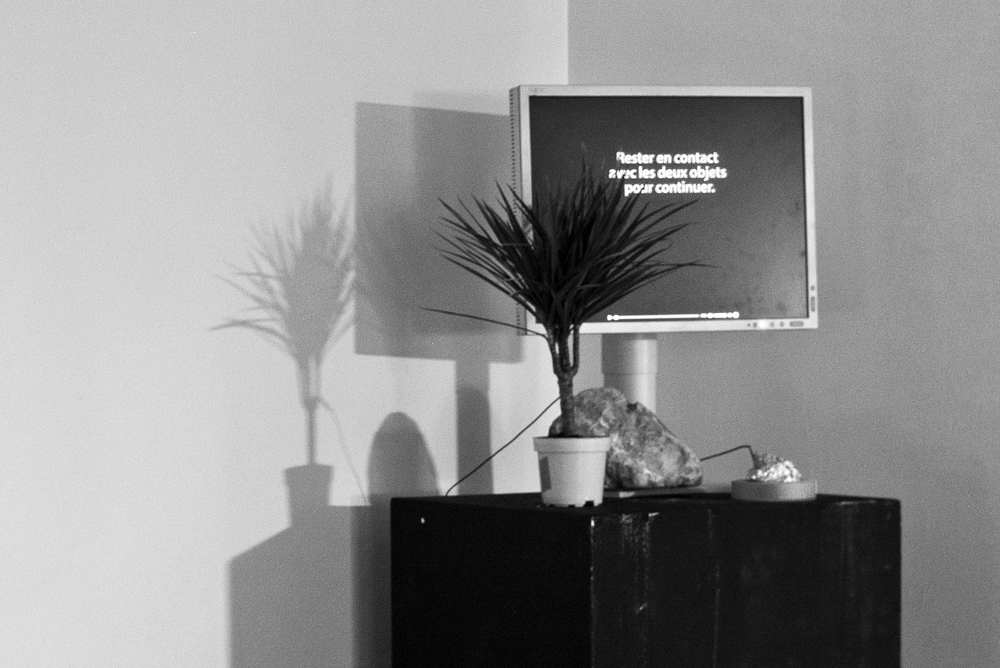

keep in touch
====

>When presenting a video in an exhibition you may want visitors to watch it from the beginning. With *Keep in touch* visitors have to stay in contact with 2 objects to keep playing.

